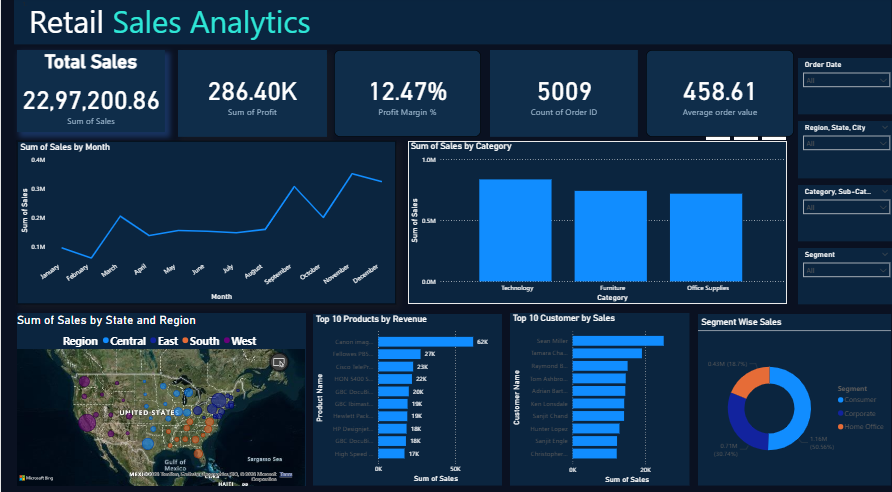

# Retail Sales Analytics Dashboard

## Project Overview
This Power BI dashboard analyzes retail sales performance, profit trends, customer behavior, and category-wise insights.

The dashboard helps businesses understand:
- Sales performance
- Profit trends
- Customer segments
- Top products
- Regional sales analysis

---

## Tools Used
- Power BI
- Microsoft Excel

---

## Key KPIs
- Total Sales: 22,97,200
- Total Profit: 286.40K
- Profit Margin: 12.47%
- Total Orders: 5009

---

## Dashboard Preview

---

## Features
- Interactive Filters
- Category-wise Sales Analysis
- State & Region Sales Map
- Top Customers Analysis
- Top Products by Revenue
- Monthly Sales Trend

---

## Files Included
- Sales analysis.pbix → Power BI Dashboard
- Sales Analysis.xlsx → Dataset
- dashboard.png → Dashboard Screenshot

---

## Business Insights
- Technology category generated highest sales
- Consumer segment contributed maximum revenue
- Sales increased significantly in November
- Certain regions showed lower profitability

